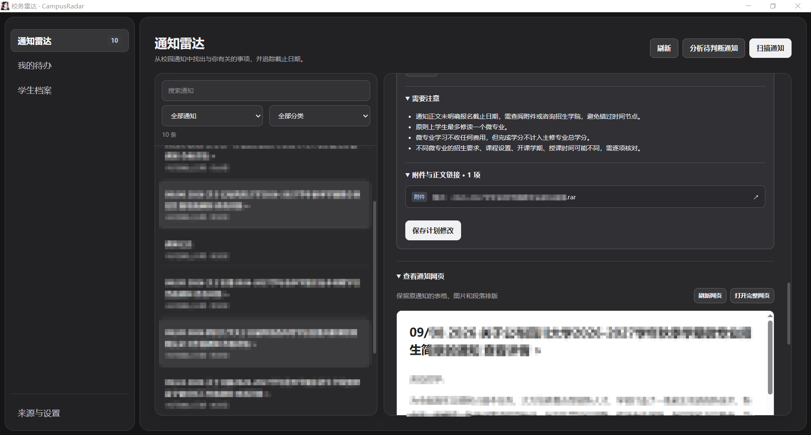
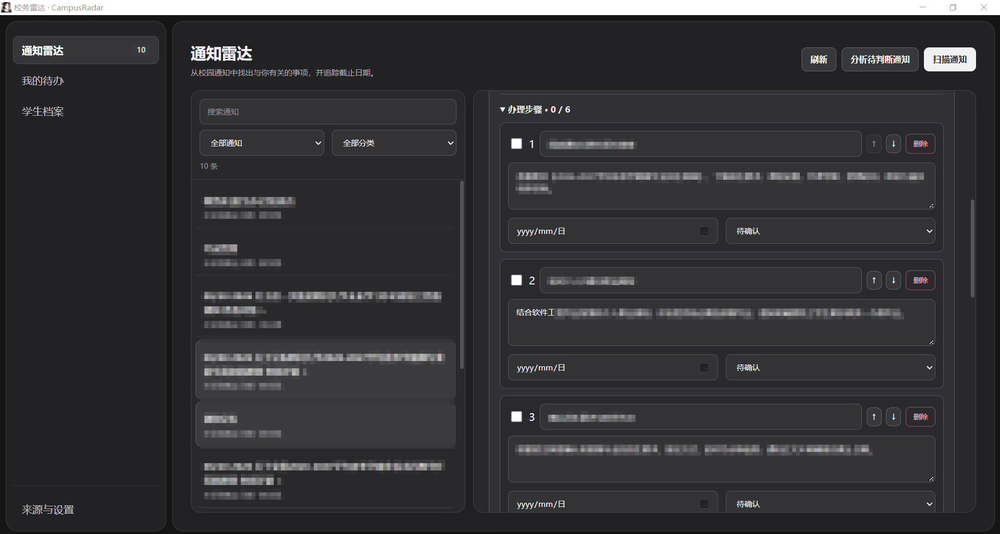

# CampusRadar · 校务雷达

面向大学生的校园通知与办事助手。扫描学校、学院或教务处的公开通知，根据学生档案判断相关性，整理材料和办理步骤，并跟踪截止日期与完成进度。

## 界面展示

### 通知网页与附件



### 办理步骤与进度



## 功能

- 公开通知扫描、去重、相关性判断与分类筛选。
- 单条或批量分析，提取有原文依据的截止日期、材料、办理步骤和风险提示。
- 人工修改分类、优先级、截止日期及步骤；支持步骤排序和完成勾选。
- 材料清单和待办看板，保存办理进度、下一步与备注。
- 通知网页视图保留表格、图片和段落；可在独立窗口打开完整原网页。
- 复制办理计划及导出 `.ics` 日历提醒。
- OpenAI 官方 Responses API 与 DeepSeek Chat Completions；设置中读取模型并保存配置。

## 通知问答（RAG）

左侧“通知问答”支持跨通知提问。先扫描来源，再点击“更新问答资料”读取尚未缓存的正文；选择检索范围后输入问题即可。支持查看引用原文、跳转通知和复制回答。

- 使用 LangChain 将完整正文切为 900 字符、重叠 120 字符的片段，没有只取前四块的限制。
- 使用本地 SQLite FTS5 / BM25 检索，中文双字切分，最多选取 6 个片段，每条通知最多 2 个。无需额外 Embedding Key；默认使用关键词检索；启用 Embedding 后与向量结果进行 RRF 排名融合。
- LangGraph 编排“检索 → 条件生成 → 引用校验”，没有命中时跳过模型调用。
- 每项回答要求引用片段编号和逐字原文，校验后剔除不存在的编号或原文。不等同于保证结论正确，用户仍需核对原通知。
- 索引保存在本地数据库中，正文修改后自动更新。仅包含成功读取的通知正文，不解析附件内容；相关片段会发送给设置中选择的模型服务。

### Embedding 混合检索

1. 在“来源与设置 → 向量检索”启用功能，填写 API 基础地址、Embedding 模型和 Key，保存后测试连接。
2. 官方地址可复用现有 OpenAI Key；如果该 Key 仅限聊天模型，需单独填写有 Embedding 权限的 Key。支持兼容 OpenAI `/embeddings` 的服务，默认模型 `text-embedding-3-small`。
3. 在“通知问答”更新正文后，点击“建立向量索引”。每批处理 16 个片段，可在失败后继续；已缓存片段不会重复生成。
4. 提问时将问题转为向量，与本地 SQLite 缓存的归一化向量计算余弦相似度，再与 BM25 排名按 RRF 融合。来源过滤和原文引用校验同样生效。

建库会发送通知片段到所配置的 Embedding 服务，提问会发送问题，并产生对应服务的调用费用。地址或模型变化后使用独立缓存；正文修改后使对应向量失效。向量服务失败时明确提示并回退到关键词检索。当前使用精确向量扫描，适合校园通知规模，没有引入独立向量数据库。

## 技术结构

| 部分 | 技术 |
| --- | --- |
| 桌面窗口 | pywebview |
| 前端 | Vue 3、TypeScript、Vite |
| 本地 API 与存储 | FastAPI、SQLite |
| Agent 工作流 | LangGraph |
| 文本切分与 JSON 解析 | LangChain Core、Text Splitters |

LangGraph 组织两个流程：

1. 通知扫描：读取来源 → 保存与去重 → 分析新通知。
2. 通知分析：读取正文与档案 → 模型生成计划 → 校验原文依据 → 保存结果。

## 本地运行

需要 Python 3.13、Node.js 22.12 或更高版本；桌面版主要在 Windows 上验证。

```powershell
python -m venv .venv
.\.venv\Scripts\Activate.ps1
python -m pip install -r requirements.txt
npm ci --prefix frontend
npm run build --prefix frontend
python desktop.py
```

首次运行后：

1. 在“学生档案”填写学校、专业、年级和关注方向。
2. 在“来源与设置”添加公开通知列表页。
3. 选择 OpenAI 或 DeepSeek，填写自己的 API Key，读取模型并保存。
4. 扫描通知，生成办理计划；确认内容后加入“我的待办”。

## 打包 Windows EXE

```powershell
powershell -ExecutionPolicy Bypass -File build.ps1
```

输出：`release/CampusRadar.exe`。构建产物未提交到仓库。

## 测试

```powershell
python -m unittest discover -s tests -q
```

覆盖本地接口、计划排序与状态保存、正文提取、日期原文校验、网页表格保留及脚本过滤。测试使用临时数据库，不需要模型密钥。

## 数据与使用范围

数据默认保存在 `%LOCALAPPDATA%/CampusRadar`。可通过 `CAMPUSRADAR_DATA_DIR` 指定其他目录。模型配置与密钥在本机保存，不包含在仓库中。

程序读取公开网页，不登录校园系统，也不自动提交申请。当前正文提取适配常见文章容器；登录页面、扫描图片、动态页面可能需要打开原网页查看。网页视图保留通知内容的排版，不执行原网页脚本。

程序运行时约每 30 分钟扫描来源。关闭程序后不会继续扫描；日历提醒需将导出的 `.ics` 文件导入日历应用。
